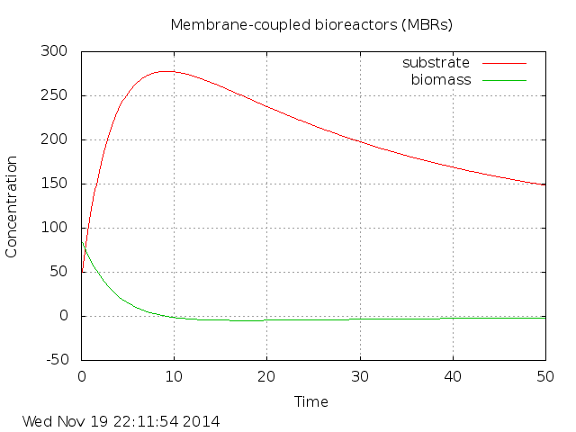

# A mathematical approach of the dynamics of a bacterial community in a membrane-coupled bioreactor

### Development branch status

### Master branch status

[Ivan E. Cao-Berg](http://www.andrew.cmu.edu/user/icaoberg/), Victor Iglesias, Wilnely Luna, Martin Engman

[School of Science, Technology and Health](http://www.suagm.edu/umet/oa_pe_ciencias_tecnologia.asp?cn_id=643), [Universidad Metropolitana](http://www.suagm.edu/umet/), San Juan, Puerto Rico

December 17, 2003

Membrane-coupled bioreactors (MBRs) are advantageous for
wastewater treatment because they are capable of retaining 100%
of bacterial cells. This research aims to establish a mathematical
model to describe the cell biomass growth and substrate removal
processes in a MBRs. The mathematical expressions for change in
the biomass are presented and combined with a substrate removal
process to describe the bacterial growth rate. We discuss the
stability of the equilibria for the biomass growth as a function
of the rate of growth (mu_{max}), decay (K_d), saturation
(K_s), and yield (eta) constants.

### Results

